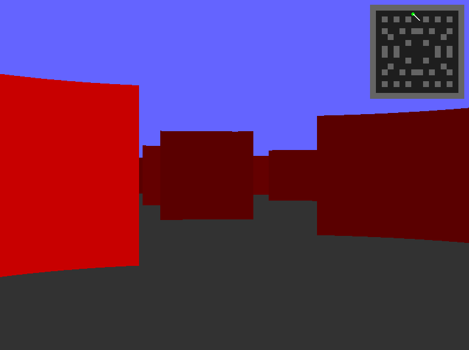

# Python Raycasting Engine

A simple 3D raycasting engine inspired by classic Wolfenstein 3D-style rendering, implemented in Python using Pygame.



## Features

- **3D Raycast Rendering**
- Dynamic lighting effects
- Mini-map display with player position/direction
- WSAD controls (movement + rotation)
- Collision detection
- Customizable map layouts
- Adjustable resolution (800x600 default)
- Sky/ground coloring
- Multiple wall textures
- Smooth player movement

## Installation

1. **Requirements**:
   - Python 3.6+
   - Pygame library

2. **Install dependencies**:
   ```bash
   pip install pygame
   ```

## Controls
 Key	Action
 W	    Move forward
 S	    Move backward
 A	    Rotate left
 D	    Rotate right
 Esc	Close game

## Customization

Modify the following in the code:

    Map layout: Edit the MAP array

    Colors: Adjust COLORS dictionary

    Resolution: Change WIDTH/HEIGHT

    FOV: Modify FOV value

    Movement speed: Adjust move_step

    Mini-map size: Change MAP_SCALE

## Technical Details

    Raycasting Algorithm: Digital differential analysis (DDA)

    Rendering: Vertical slice-based rendering

    Performance: ~30 FPS on modern hardware

    Collision Detection: Grid-based wall checking